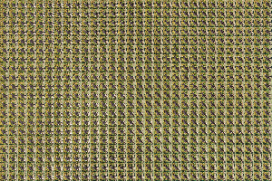
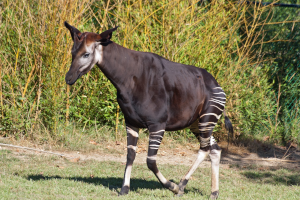
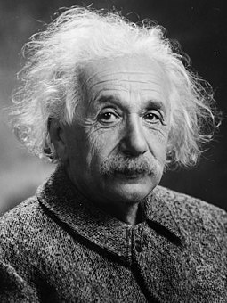
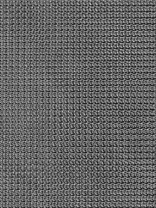
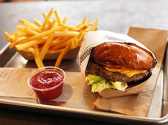
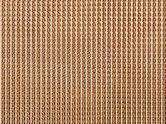

# anonimage

**anonimage** is a command line tool to **anon**ymize **image**s by shuffling
its pixels around. The shuffling is done via a well defined and easy to
understand algorithm. **anonimage** can also _unshuffle_ the privously shuffled
image. The shuffling can be done multiple times to increase the seeming randomness.
When unshuffling, the same amount of unshuffling is necessary to get back the
original image.

## Why

You want the cheap prices of the tech giants' image backup solutions, but
you don't want your images used for AI training? Encryping is usually not possible
there, so it needs another way.

## Examples

These example images were _shuffled_ and _unshuffled_ using **anonimage**:

| Before                                  | Shuffled                                    | Unshuffled                                      |
| --------------------------------------- | ------------------------------------------- | ----------------------------------------------- |
|     |     |     |
|  |  |  |
|    |    |    |

## Usage

`anonimage --help` shows you the basic usage:

```
Usage of anonimage:
  --input string
        Input file path
  --output string
        Output file path
  --shuffle
        Run in shuffle mode
  --unshuffle
        Run in unshuffle mode
```

To shuffle an image, run: `anonimage --shuffle --input testdata/burger_normal.jpg --output testdata/burger_shuffled.png`

To unshuffle an image, run: `anonimage --unshuffle --input testdata/burger_shuffled.png --output testdata/burger_unshuffled.png`

## Algorithm

**anonimage** reads the images' pixels into an 1D array. The array is split into
chunks. While iterating the pixels, they are put into different chunks. For example:
Pixel 1 is put at the first chunks first position. Pixel 2 is put at the second chunks
first position. After reaching the last chunk, it starts back in chunk 1.
